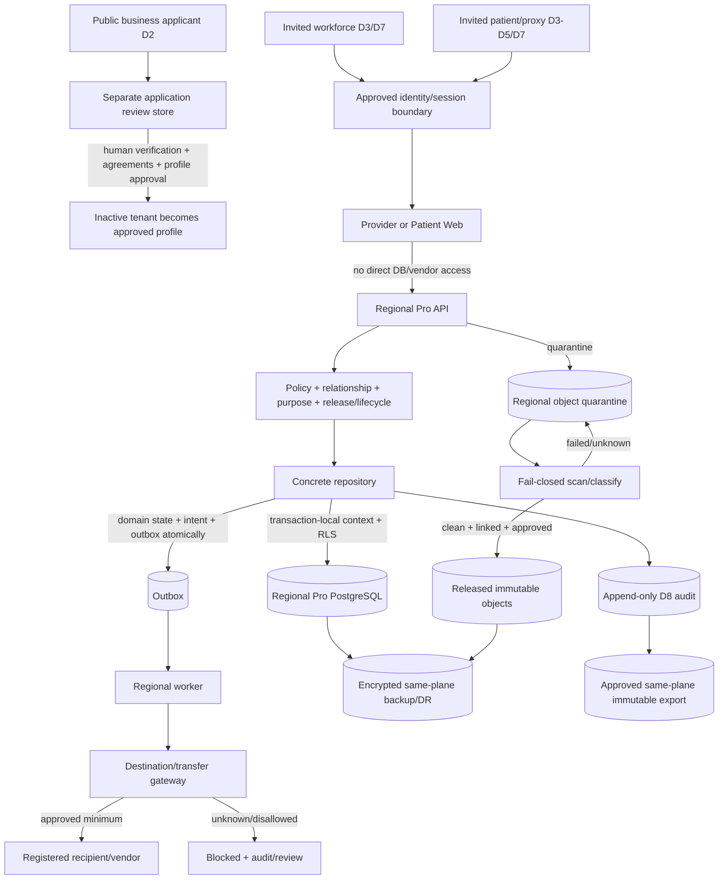

# Flowstate Pro data classification and flows

**Status:** SPECIFIED PLANNING TARGET — field inventory, legal classification, vendors, agreements, retention values and deployed residency evidence remain incomplete  
**Decision baseline:** Q1–Q206, confirmed 2026-08-24  
**Scope:** Flowstate Pro only; Virginia and British Columbia customer profiles are separately activated

## 1. How to use this document

This is the Pro classification vocabulary, store/destination model and planned flow map. It is not the completed field-level inventory required before implementation and production activation. Classification is contextual: a value becomes regulated based on the person, organization, relationship, purpose, location, record origin, contract and applicable law—not merely a column name.

Labels distinguish:

- **CURRENT — Standard:** implemented fitness-product facts from current code/schema, included only to prevent false reuse claims.
- **PLANNED — Pro:** approved target behavior that does not yet exist.
- **BLOCKED:** legal, vendor, policy or production inputs a code author cannot choose.

Google states that customers remain responsible for determining status, BAA need, application configuration and their own HIPAA compliance.[1] These categories and controls therefore require named legal/privacy/security review before they become approved operating rules.

## 2. Product boundary

### CURRENT — Standard

The implemented Prisma schema is the Standard gym product. It contains identity/contact data, DOB, member/guardian notes, attendance, forms and signed-document evidence, billing/Stripe references, migration raw/mapped content, messages/notification bodies and sessions. It stores form bytes in PostgreSQL and allows some migration content in PostgreSQL JSON/text. Standard also has a filesystem-backed landing waitlist. None of this is a Pro clinical store, Pro migration source, or evidence of Pro controls.

### PLANNED — Pro

Pro has separate applications, identities, database/schema, object storage, audit, logs, backups, keys, vendors and regional data planes. There is no Standard-to-Pro migration. Data from an external clinical system may enter only through a separately approved Pro migration service and provenance workflow. Shared monorepo code is restricted to reviewed data-free primitives and pure utilities.

## 3. Data-classification vocabulary

Classification uses the highest applicable class until a reviewed field/purpose profile establishes a narrower one.

| ID | Class | Examples | Default handling |
|---|---|---|---|
| `D0` | Public | Approved marketing copy, public service availability, published contact channel. | Public only after content approval; no user data or internal identifiers. |
| `D1` | Internal business/configuration | Non-secret feature/config definitions, synthetic catalog fixtures, approved white-label display settings. | Workforce need-to-know; no production patient/customer content. |
| `D2` | Business contact / application PI | Applicant name, business email/phone, organization, role, jurisdiction/application answers. | Public landing collects the minimum; separate application store/lifecycle; never silently becomes an activated patient/workforce identity. |
| `D3` | General personal information | Name, email, phone, address, DOB, language/accessibility preferences, user-agent/IP where retained. | Purpose-minimized, tenant-scoped, encrypted, audited where sensitive, lifecycle-governed. Context can elevate to `D4`. |
| `D4` | Clinical/health and regulated record data | Patient identifiers in care context, encounters, appointments, intake, medications, allergies, history, diagnoses/treatments when enabled, notes, observations, clinical files, consent/authorization, representative authority, rights requests, release/disclosure records. | Highest normal regulated controls: backend-only, policy/repository/RLS, minimum fields, immutable final history, envelope encryption where designated, full audit/lifecycle. |
| `D5` | Highly restricted clinical/identity data | SSN/SIN, government ID, biometrics, genetics, especially sensitive diagnoses/treatments, unrestricted narratives, identity proof, legal process/evidence, migration access instructions. | Disabled by default. Enable only for approved purpose/authority, field schema, role projection, encryption, retention, destination and human review. |
| `D6` | Financial/payment data | Charges, invoices, coverage/eligibility, amounts, status, opaque processor/customer/payment references, limited payment-method display data. | Separate billing projection and Stripe boundary; no raw card/bank credentials in Pro; context may make values `D4`. |
| `D7` | Authentication/security secrets | Password verifier, session/invite/recovery token hashes, MFA secret/recovery material, webhook/vendor secrets, encryption metadata/key references. | Never log or expose; hash or encrypt by type; least-privilege secret/key store; short lifecycle and rotation. |
| `D8` | Security/audit metadata | Opaque actor/resource IDs, action, outcome/reason, request/operation IDs, assurance, destination ID, policy version, PHI-free incident signals. | Separate append-only access; no clinical/free-form payload; approved immutable retention. |
| `D9` | Legal/governance confidential | Agreement/evidence references, counsel decisions, incident chain-of-custody references, personnel/training/sanction metadata. | Repository stores only approved metadata/references. Contracts, legal advice, personnel files and incident evidence remain in approved external systems. |
| `DX` | Prohibited or unresolved | Unbounded fields without approved purpose; raw secrets; card data; unsupported file types; unknown external payloads; unidentified live test data. | Reject/quarantine/block. Unknown does not default to `D1` or an allowed destination. |

### Context elevation rules

- `D2`/`D3` becomes at least `D4` when linked to a patient, care relationship, clinical organization, appointment, diagnosis/treatment, rights request or clinical disclosure.
- Free-form text and JSON default to the highest class permitted by the feature; an unrestricted clinical narrative is `D5` and disabled unless approved.
- Identifiers in paths, logs or vendor metadata are not harmless merely because opaque; their linkage, access pattern and destination determine classification.
- Derived scores, analytics, embeddings, transcripts, thumbnails and extracted text inherit the source class unless a reviewed de-identification process proves otherwise. No de-identification process is approved by this document.
- Hashes of identifying values remain classified when linkable or susceptible to matching. Encryption changes protection, not classification.
- Patient-reported and clinician-verified content share the same sensitivity but retain distinct provenance and verification state.

## 4. Profile-enabled data catalog

| Domain | Planned examples | Base class | Activation rule |
|---|---|---:|---|
| Organization/application | Business contact, entity/customer classification, jurisdiction/data-flow answers, operating envelope, agreements/evidence references. | D2/D9 | Landing accepts only minimal D2. Regulated tenant remains inactive until reviewed. |
| Workforce identity | Name/contact, tenant membership, role/grants, license/specialty metadata if required, MFA/session/recovery. | D3/D7 | Invitation + verified organization; workforce MFA/step-up. |
| Patient identity | Demographics/contact, preferred language, approved accessibility/contact preferences, chart identifier. | D3→D4 | Clinic invitation and profile-defined fields; high-risk changes reviewed. |
| Proxy/representative | Identity, relationship/authority type, scope, evidence reference, dates, revocation/majority transition. | D4/D5/D9 | Explicit verified grant; no relationship inference. |
| Scheduling/intake | Appointments, reason only if approved, forms, patient-reported history, consents/authorizations. | D4 | Minimum safe clinical journey; profile and purpose gates. |
| Longitudinal chart | Encounters, notes, medications, allergies, history, observations, diagnoses/treatments. | D4/D5 | Diagnoses, treatments and unrestricted narratives disabled until profile approval. |
| Clinical integrity | Draft/final state, signatures, amendment/late-entry chain, provenance, release state. | D4/D8 | Required for every enabled clinical content type. |
| Clinical files | Metadata/hash/classification/provenance plus encrypted object body. | D4/D5 | Controlled types, quarantine/scan, patient/encounter linkage, immutable versions. DICOM disabled absent PACS profile. |
| Billing/eligibility | Direct-pay invoices/amounts/status, processor references, approved eligibility data. | D6→D4 | Separate Stripe/configuration boundary; no raw payment credentials. |
| Privacy/rights | Purpose/legal-authority, consent/authorization, rights requests, identity verification, decisions, fulfilment, disclosure accounting. | D4/D5/D9 | Counsel/privacy-owned policy and deadlines. |
| Lifecycle/legal hold | Policy references, disposition dates/states, hold scope/reason/reference, custody/offboarding state. | D4/D8/D9 | Unknown retention blocks destruction. |
| Audit/incident | PHI-free action metadata and signals; evidence references. | D8/D9 | Payload-free, append-only; human reportability decision. |
| External migration | Source file/object, mappings, validation issues, provenance, reconciliation and import result. | D4/D5 | External clinical systems only; separate approved service and destination/source profile. |

## 5. Data stores

### CURRENT — Standard stores (not reusable for Pro)

| Store | Current content | Pro disposition |
|---|---|---|
| Standard PostgreSQL/Prisma | Fitness identities, membership, attendance, forms/PDF bytes, billing, migration JSON/text, messages/jobs, sessions. | No connection, schema sharing, replication or migration into Pro. |
| Standard landing filesystem JSONL | Business waitlist/applicant data. | Pro landing/application data requires a separate managed store and lifecycle. |
| Standard Stripe objects/webhooks | Standard product/customer/payment metadata. | Separate Pro Stripe configuration/account, secrets, products/prices, objects and reconciliation. |
| Standard browsers/test artifacts/dev volumes | Standard rendered data, cookies, local/test artifacts. | No reuse of credentials or live data; Pro non-production is synthetic only. |

### PLANNED — Pro stores

| Store | Classes | Region/residency target | Access and lifecycle |
|---|---|---|---|
| Pro-US PostgreSQL | D1–D9 metadata and structured records; no file bodies/secrets | `us-east4`, same-country DR `us-east1` | Pro API/repositories/workers only; transaction context + RLS; HA/PITR/backups; lifecycle/hold; separate admin credentials. |
| Pro-Canada PostgreSQL | Same, Canada plane only | `northamerica-northeast2`, same-country DR `northamerica-northeast1` | No US runtime/replica; same controls. |
| Regional quarantine buckets | D4/D5 file bodies and migration objects | Matching primary plane | Write-only intake as scoped; scanner; inaccessible to users until clean/released; failed/inconclusive remains quarantined. |
| Regional released-object buckets | D4/D5 immutable file versions and export staging | Matching primary plane | API-mediated access, opaque keys, CMEK/envelope encryption as designated, lifecycle/hold, no durable browser URL. |
| Regional backup/recovery copies | Full store class inheritance | Matching primary/DR plane and recovery/archive project | Restricted recovery identity; encrypted; retention/expiry; isolated restore and current-policy reconciliation. |
| Append-only security audit | D8, never clinical payload | Matching plane; regional WORM export after approval | Insert-only runtime; security/privacy readers; immutable retention after policy approval. |
| Disclosure/accounting ledger | D4/D8/D9 references and minimized recipient/purpose metadata | Matching plane | Separate from security audit; policy-filtered rights fulfilment. |
| Incident/evidence metadata | D8/D9 references | Matching approved security boundary | Minimal metadata in Pro; evidence body in approved protected system, not repo/general logs. |
| KMS/Secret Manager | D7 keys/secret versions and access metadata | Separate keys/secrets per plane/environment/service | Minimum IAM; keys never stored in DB/source; rotation/disable/recovery controls. |
| Transactional outbox/job tables | D4/D6/D8 minimized work payload/reference | Same PostgreSQL plane | Atomic with business state; encrypt sensitive work payload or use opaque references; bounded retry and expiry. |
| PHI-free logs/metrics | D1/D8 bounded metadata | Regional sinks/WORM export in matching plane | Allowlist only; no bodies/free text/tokens/patient labels; retention approved and evidenced. |
| CI/build/artifact registry | Source, images, SBOM/provenance; synthetic test output only | Separate Pro build/promotion projects/approved locations | Production data prohibited; secrets redacted; controlled retention and promotion. |
| Business application/contract systems | D2/D9 | **BLOCKED** pending approved systems/regions | Only minimum application/contract metadata may synchronize; confidential documents stay outside repo. |

Cloud Run resources are regional and associated customer data is stored in the selected region.[3] This does not settle control-plane, support, identity, logging, build or third-party locations; each is a transfer-review item.

## 6. Destination registry contract

No destination can receive `D2`–`D9` until a versioned registry entry is enabled for the exact plane/customer profile. Required fields:

- stable destination/provider/service ID and owner;
- purpose and allowed operations;
- allowed data classes and explicit minimized fields;
- source/record origin and destination country/region;
- transfer direction and onward/subprocessor handling;
- authentication/encryption and key responsibility;
- retention, deletion, backup and support-access behavior;
- BAA/DPA/customer agreement status and evidence references;
- privacy impact/transfer approval status and dates;
- tenant/profile enablement, rate/volume limits and operating envelope;
- incident/contact/reconciliation method;
- reviewer, effective/expiry/review dates and disable/rollback action.

Unknown provider, service, region, class, agreement, transfer approval or deletion behavior is `BLOCKED`, never inherited from another service or a vendor marketing page.

### Planned destination classes

| Destination | Minimum data | State |
|---|---|---|
| Separate Pro Stripe boundary | Opaque tenant/patient/billing references, approved contact fields only where necessary, amount/currency/status; no clinical narrative/diagnosis. | Planned; agreement/configuration/metadata profile approval required. |
| Email delivery | Address, approved recipient name, minimal template and secure-action link; no clinical detail in subject/body unless explicitly approved. | Vendor **BLOCKED**. Prefer portal notification with minimal email. |
| Secure export recipient | Approved rights/offboarding package, manifest, hashes and expiry. | Per-request authority, destination and transfer gate. |
| Monitoring/incident notification | D8 PHI-free code/count/correlation metadata only. | Vendor/SIEM **BLOCKED**; raw application payload prohibited. |
| Calendar | Minimal appointment busy/time and opaque reference; no patient/clinical detail by default. | Disabled by default; vendor/profile approval required. |
| Standards gateway/external EHR | Profile-minimized clinical resources, provenance and purpose. | Deferred/separately gated; standards and partner agreement/profile required. |
| PACS/RIS/DICOM | Approved imaging objects/metadata. | Deferred and separately gated; never ordinary upload. |
| Lab/pharmacy/clearinghouse/telehealth | Profile-specific minimum clinical/administrative fields. | Deferred; vendors and legal/contract/profile controls **BLOCKED**. |
| External clinical migration source | Approved export files/API data plus source provenance. | No Standard source; governed migration service only. |
| Legal/regulator/law enforcement | Only reviewed scope through Legal/Privacy process. | No automated/routine destination; case-specific approval. |

## 7. Planned end-to-end flows

### Flow table

| Flow | Source → destination | Data/class | Controls and outcome |
|---|---|---|---|
| 1. Public application | Browser → Pro application endpoint/store | Minimum D2; no patient/clinical data | Notice/consent as approved, abuse/rate controls, separate lifecycle. Does not create an active regulated tenant. |
| 2. Tenant activation | Application metadata + human evidence → activation registry | D2/D9 | Verify organization/status/customer type/use case/jurisdiction/flows/contracts. Unresolved classification cannot activate. |
| 3. Identity invitation/session | Organization/patient invite → identity service → browser session | D3/D7 | Separate Pro identity; MFA, recovery/revocation, idle/absolute limits; CIAM vendor blocked pending review. |
| 4. Clinical create/read | Web → API → policy/repository → PostgreSQL | D3–D5 | Backend-only; trusted context; role/relationship/purpose; minimal projection; RLS; audit. |
| 5. Patient/proxy access | Patient Web → API → authority/release policy → repositories | D3–D5 | Explicit authority grant and dates; own/scoped data only; released state; step-up for high risk; audit. |
| 6. Clinical finalize/amend | Provider Web → API → clinical aggregate | D4/D5/D8 | Draft editable; final immutable; amendment/late entry links prior version, author/time/reason/signature; concurrency and audit. |
| 7. File upload | Browser → API → quarantine bucket → scanner → released bucket/metadata | D4/D5 | Controlled type/size, opaque key, hash, classification/provenance, fail-closed scan, immutable version, lifecycle; DICOM blocked. |
| 8. File read | Web → API → metadata policy → short-lived object response | D4/D5/D8 | Reauthorize each read, no bucket credential/durable URL, safe headers/no-store as approved, audit. |
| 9. Payment | Web/API → destination gateway → separate Pro Stripe; webhook → API | D3/D6→D4 | Configured origins, minimized metadata, verified webhook/tenant mapping, idempotency, outbox/intent/outcome, no raw card data in Pro. |
| 10. Notification | Domain transaction → outbox → gateway → approved email/provider | D3/D4 minimized | Portal-first/minimal content, approved destination/agreement/region, retries/reconciliation, disclosure/audit. |
| 11. Rights request | Authenticated patient/proxy → API → customer Privacy workflow → secure fulfilment | D4/D5/D9 | Risk-based identity verification, scoped request/deadline/decision/appeal, step-up, approved export destination, expiry and audit. |
| 12. Export/offboarding | Repositories/objects → encrypted staging → approved recipient | D3–D6/D9 | Human-readable + structured, manifest/hashes/reconciliation, secure transfer, staging destruction, retention/hold/custody separation. |
| 13. External clinical migration | Approved external source → quarantine/staging → validation/reconciliation → Pro roots | D4/D5 | No Standard source; provenance, classification/scan, profile approval, immutable source evidence, idempotent import, reconciliation. |
| 14. Lifecycle disposition | Policy/hold registry → planner → report-only/approved worker → stores | All stored classes | Unknown policy/hold blocks; dry run, independent approval, outbox/audit, archive/delete verification, backup truth. |
| 15. Audit/incident | Sensitive operation → append-only audit → PHI-free signal → human incident workflow | D8/D9 | No payload; intent/outcome; independent retention; humans decide reportability/notice. |
| 16. Backup/DR | Primary stores → same-plane backup/replica/recovery project → isolated restore | Inherits all classes | Encryption, region controls, restricted identity, retention/expiry, measured replica lag, manual failover, restore reconciliation. |
| 17. Build/test | Synthetic generator/source → CI/apps/artifacts | D0/D1 synthetic only | Production export/import prohibited; canary scans; separate projects/secrets; artifact retention. |
| 18. Exceptional support | Approved ticket/incident → JIT Flowstate identity → minimum metadata/data resource | D8; D3–D5 only if strictly necessary | No routine access or break-glass; device/MFA, scope/time/approval, audit/revocation/review. |

## 8. Browser, URL, cache and telemetry flow rules

- Names, email, phone, clinical text, search terms, tokens and provider-sensitive values do not enter URLs/query strings, redirect locations, Referer headers, filenames or route logs.
- Browser cookies contain opaque session material only and are product/origin scoped, secure and HTTP-only.
- `localStorage`, `sessionStorage`, IndexedDB, Cache API, service workers, analytics, advertising, session replay and third-party scripts receive no classified data unless a separately approved design proves purpose, agreement, residency, minimization and lifecycle.
- Server-rendered HTML/RSC/JSON contains only fields the current actor may render. Hidden elements are still disclosure and are prohibited.
- Sensitive responses/downloads use approved cache controls and safe content disposition; logout/expiry clears application-held sensitive state where feasible, while server authorization remains authoritative.
- Traces, screenshots, console/network captures, test reports and support recordings are synthetic-only outside production. Production diagnostics use PHI-free metadata.

## 9. Audit and log data flow

### Security audit (`D8`)

Allowed: opaque event/request/operation/actor/tenant/resource IDs, time, action, outcome/reason code, session assurance, purpose/legal-authority and policy version, destination ID, integrity metadata.

Prohibited: request/response bodies, names/contact data, clinical text, form/file contents or names, raw IP unless specifically approved, tokens, secrets, SQL/bind data, vendor payloads and free-form errors.

High-risk operations create durable intent before effect and terminal outcome after effect. Audit storage is separate and append-only; denied/failed events survive business rollback.

### Operational logs/metrics (`D1`/`D8`)

Allowlisted event codes, service/revision, route template, timing, status, bounded counts and correlation IDs only. No patient, clinical or arbitrary object serialization. Regional log sinks and immutable exports activate only with approved retention and read-back evidence. Bucket Lock can prevent objects from deletion/replacement before the retention period and a locked policy cannot be reduced or removed.[8]

## 10. Residency and project topology

| Data plane | Primary | Same-country recovery | Allowed normal movement | Explicit transfer-review items |
|---|---|---|---|---|
| Pro-US | `us-east4` — Northern Virginia | `us-east1` — South Carolina | Within approved US workload/recovery/archive projects and registered US destinations. | Identity/support/control plane, vendors, Stripe/email, logs/builds, legal recipients, any Canada transfer. |
| Pro-Canada | `northamerica-northeast2` — Toronto | `northamerica-northeast1` — Montréal | Within approved Canada workload/recovery/archive projects and registered Canada destinations. | Patient CIAM, Flowstate identity/support/control plane, vendors, builds, logs, contracts, any US transfer. |

Google lists these regional locations.[2][3] There is no selected Vancouver region, so the design must not claim BC-only hosting. Resource-location policies can restrict resource creation and data replication locations, but every actual service and data path still needs verified configuration and contract evidence.[10]

Cloud SQL HA synchronously replicates between zones in the primary region.[4] The same-country DR replica is cross-region and asynchronous, so replication lag and non-zero RPO must be measured and disclosed internally; promotion is a manual incident decision.[5] US does not fail over to Canada and Canada does not fail over to the US.

### Canadian boundary caveat

The Canadian target covers configurable application data, database, object bodies, backups, keys and logs in Canada. Patient CIAM, Google/Flowstate administrative control planes, workforce support access, build systems, billing, DNS/CDN and each subprocessor are explicit transfer-review items. No document may convert this target into a blanket “all data stays in Canada” or “BC-only” claim without verified evidence and counsel approval.

## 11. Encryption flow

At rest, every store/replica/backup/log/audit/artifact/restored copy requires verified provider encryption. Highest-sensitivity fields and file bodies use application-layer envelope encryption: a local DEK encrypts the value, a Cloud KMS KEK wraps the DEK, and storage retains ciphertext plus wrapped DEK and version metadata; the KEK remains in Cloud KMS.[7]

Authenticated context binds tenant, resource, field/class and schema/key version. Decrypt occurs only after policy authorization in backend memory and plaintext is not written to logs, audit, queues, temp files or fallback columns. Rotation/rewrap and encryption migrations use additive dual-read/write compatibility, synthetic backfill, reconciliation and later plaintext removal. Search on encrypted values is not planned without separate approval.

Encryption does not declassify data or permit a destination. KMS failure blocks encrypt/decrypt; there is no application-embedded key or plaintext fallback.

## 12. File lifecycle

| State | Body access | Transition requirement |
|---|---|---|
| `RECEIVING` | Upload service only | Approved tenant/profile/type/size; opaque object; checksum in progress. |
| `QUARANTINED` | Scanner and narrowly approved security workflow | Metadata/classification/provenance recorded; no user download. |
| `REJECTED` | Security workflow only | Malware/type/policy failure; reason code only in normal logs; lifecycle/disposition applies. |
| `CLEAN_UNLINKED` | Authorized workflow only | Successful scan; cannot be released until patient/encounter, provenance, classification and lifecycle links validate. |
| `ACTIVE_DRAFT` | Authorized clinical actors | Linked clean object; draft rules and version ID. |
| `FINALIZED` | Authorized actors per release state | Immutable body/version; signatures/finalization; no overwrite/delete. |
| `AMENDED` | Authorized actors; prior remains accessible by policy | New linked immutable version/amendment with author/time/reason/prior link. |
| `ON_HOLD` | Read as policy allows; no disposition | Independently controlled legal hold. |
| `ARCHIVED` | Restricted retrieval workflow | Approved lifecycle decision and verified archive. |
| `DISPOSITION_PENDING` | Restricted | Dry run, hold recheck, approval, outbox/audit intent. |
| `DISPOSED` | No active body; tombstone/evidence only as approved | Verified deletion/expiry, audit outcome and backup truth/reconciliation. |

DICOM/PACS bypasses this ordinary-upload model and remains disabled until its dedicated integration profile is approved.

## 13. Record lifecycle, retention and deletion

Every regulated root and file has a lifecycle/policy reference. A central versioned registry records classification date, policy version, scheduled review/disposition, legal hold, custody/offboarding state and last decision. Creation/update of lifecycle metadata is atomic with the regulated root; reconciliation detects missing/orphaned metadata.

Retention is determined by approved profile, record type, age, provider, jurisdiction, contract and hold. No duration is invented here. Multiple applicable requirements use the most restrictive approved rule; unknown/conflicting input yields `REVIEW/BLOCKED`, not deletion.

Disposition is a state machine:

1. planner computes retain/archive/delete/review without mutation;
2. hold, rights request, custody, export and offboarding checks run;
3. approved worker persists intent and claims idempotently;
4. archive/delete occurs through store-specific APIs;
5. result is read back/reconciled and terminal outcome recorded;
6. primary tombstone/evidence remains only as approved;
7. backups expire under their truthful schedule and restored copies reapply current policy.

Commercial cancellation/nonpayment never directly deletes or makes legally/emergency-required records inaccessible. Offboarding separately governs custody, continued access, export, holds, integrations, retention and destruction.

## 14. Data minimization and default-disabled content

The following remain disabled until an approved customer/applicability profile names the purpose, authority, exact fields, collection UI, roles/projections, encryption/search model, destinations and retention:

- SSN/SIN and government identifiers;
- biometric templates and genetic data;
- diagnoses, treatment details and other specialty-sensitive classes beyond the approved minimum journey;
- unrestricted narrative/custom fields;
- DICOM/PACS, lab, pharmacy, clearinghouse, telehealth and clinical AI data;
- native mobile/offline caches, analytics, session replay and third-party browser SDKs;
- broad calendar details;
- cross-border replication or automatic transfer;
- live data in non-production.

A field or module not enabled by profile is absent/rejected, not merely hidden.

## 15. Blocked inputs and required evidence

The following must remain visibly `BLOCKED` until named owners approve them:

- exact customer/entity and Canadian role classifications;
- field-level legal classifications and allowed high-risk fields;
- consent/authorization text, purpose/legal-authority catalogs and rights deadlines;
- retention schedules, legal-hold and backup expiry rules;
- patient CIAM and email/monitoring/calendar/clinical integration vendors;
- BAA/DPA/customer agreement and subprocessor status for every actual service;
- exact resource/control-plane/support/vendor regions and transfer assessments;
- breach/reportability rules, evidence systems and notification ownership;
- first specialty/customer profiles, operating envelopes and public claims.

Before activation, the data inventory must enumerate every field and non-database store with classification, purpose, actors, read/write paths, repository/policy action, encryption state, destination IDs, residency, retention/lifecycle policy, reviewer and date. Automated drift checks must fail when schema, event, file type, log field, queue payload, vendor or browser flow lacks review.

## Sources

[1] [HIPAA Compliance on Google Cloud](https://cloud.google.com/security/compliance/hipaa)  
[2] [Google Cloud regions and zones](https://docs.cloud.google.com/compute/docs/regions-zones)  
[3] [Cloud Run locations](https://docs.cloud.google.com/run/docs/locations)  
[4] [Cloud SQL for PostgreSQL high availability](https://docs.cloud.google.com/sql/docs/postgres/high-availability)  
[5] [Cloud SQL disaster recovery](https://docs.cloud.google.com/sql/docs/postgres/intro-to-cloud-sql-disaster-recovery)  
[7] [Cloud KMS envelope encryption](https://cloud.google.com/kms/docs/envelope-encryption)  
[8] [Cloud Storage Bucket Lock](https://docs.cloud.google.com/storage/docs/bucket-lock)  
[10] [Google Cloud regulatory compliance and privacy guidance](https://docs.cloud.google.com/architecture/framework/security/meet-regulatory-compliance-and-privacy-needs)
