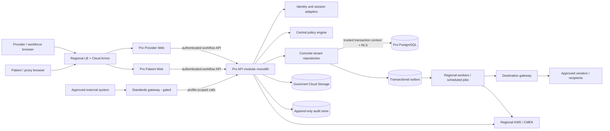

# Flowstate Pro system design

**Status:** SPECIFIED PLANNING TARGET — not implemented, deployed, legally reviewed, or approved for production  
**Decision baseline:** Q1–Q206, confirmed 2026-08-24  
**Scope:** Flowstate Pro only; Virginia first, British Columbia as a separately gated follow-on

## 1. Reading rule

This document describes the approved **planned Pro architecture**. It does not describe Pro as built. Facts labelled **CURRENT — Standard** come only from the existing applications and `packages/db/prisma/schema.prisma`; they are included to prevent accidental reuse or false implementation claims. When this document conflicts with an approved decision, the decision register wins.

Google states that HIPAA support is within a Business Associate Agreement and that the customer remains responsible for configuring and securing its applications; no HHS-recognized HIPAA certification is created by using Google Cloud.[1] Accordingly, this design is a control specification, not a compliance claim.

## 2. Product and isolation boundary

### CURRENT — Standard baseline

- `apps/admin-web` is the owner/coach Next.js application.
- `apps/member-web` is the customer portal and public trial/signing application.
- `apps/landing-web` is the public marketing/waitlist application.
- `apps/api` exposes only a health route; Standard business behavior mostly uses app-local server actions and route handlers.
- `packages/db/prisma/schema.prisma` is one PostgreSQL/Prisma schema for the fitness product. It defines `OWNER`, `COACH`, and `CUSTOMER` roles; workspace-scoped application filters are common, but the schema does not implement PostgreSQL RLS, Pro clinical models, legal holds, a general audit ledger, or field-level encryption.
- Standard currently stores form bytes and some migration source content in PostgreSQL and permits direct Prisma use outside `packages/db`.

### PLANNED — Pro invariant

Pro is a separate clinical-record product, not a Standard tier or migration destination. It has separate applications, browser origins, credentials, sessions, identity configuration, databases/schema, storage, backups, keys, logs, monitoring, secrets, vendors, Stripe configuration, access groups, deployments, and CI/CD promotion. The same email may exist in both products only as unrelated identities. No Standard-to-Pro migration exists.

The monorepo may share only reviewed data-free UI/configuration primitives and pure utilities. Pro code must not import Standard database, auth, billing, session, or domain packages.

## 3. Three Pro applications

| Application | Planned responsibility | Explicit exclusions |
|---|---|---|
| **Pro Provider Web** | Organization administration; provider and workforce workflows; scheduling; intake review; longitudinal chart; clinical notes and amendments; files; billing; privacy/rights queues; tenant break-glass UI. | No Prisma client, SQL, vendor SDK, KMS primitive, legal-policy internals, or direct object-store access. No Flowstate support console embedded in the tenant app. |
| **Pro Patient Web** | Invitation-based patient access; approved profile maintenance; scheduling; intake/consent/forms; released records; payments; security/session controls; proxy management; rights requests and secure fulfilment. | No direct database/storage/vendor access. No discovery of uninvitied patients or organizations. No hidden workforce capability. |
| **Pro API** | Regional modular-monolith backend and sole online data boundary: authentication/session adapters, REST workflow API, authorization/policy, repositories, RLS transaction context, clinical integrity, object metadata, jobs/outbox, destination gateway, audit, and integration adapters. | Not a general anonymous public data API. Standards traffic uses a separately gated gateway/surface. No cross-plane database connection. |

The provider and patient applications are presentation clients. Server-side rendering does not grant database authority: their server code calls the Pro API over authenticated private service-to-service channels. Only Pro API and narrowly scoped Pro workers use Pro data credentials.

## 4. Logical architecture

Cloud Run resources are regional and associated customer data is stored in the selected region; all four selected primary/DR regions are listed Cloud Run locations.[3] Region selection alone does not prove that every control-plane, vendor, support, identity, or network flow remains in that region.

## 5. Request and authorization path

Every request that can touch classified data follows one path:

1. The edge applies TLS, host allowlisting, rate controls, and route normalization.
2. The Pro API validates the application/service identity and authoritative user session.
3. A server-created access context binds actor, tenant, role/permissions, session, MFA/step-up assurance, patient/proxy authority where applicable, purpose, policy/profile version, source classification, and request/operation IDs. Caller input cannot set these fields.
4. Central policy evaluates action, resource class, tenant status, profile, actor relationship, purpose/legal authority, destination, lifecycle state, and assurance. Unknown or conflicting inputs deny.
5. A concrete repository opens a database transaction, sets the trusted tenant/actor/purpose context, and performs a minimal projection or mutation.
6. PostgreSQL RLS enforces tenant isolation as a second boundary. Composite tenant integrity prevents a child record from referring to another tenant's root.
7. The operation records a terminal audit outcome. High-risk operations first persist durable intent and later correlate terminal outcome.
8. External transmission is created through the outbox and destination gateway, never inline through an arbitrary vendor SDK.

### RLS and repository contract

- The normal application database role has no `BYPASSRLS`, does not own regulated tables, and is subject to `FORCE ROW LEVEL SECURITY` where supported by the migration design. Google notes that PostgreSQL table owners and roles with `BYPASSRLS` can bypass RLS; those identities therefore remain migration/administration-only and unavailable to application runtime.[6]
- Tenant context is local to the current transaction and cleared by transaction end; pooled sessions must never retain a previous request's context.
- Missing tenant context produces no access, not an unscoped query.
- Policy checks do not replace RLS, and RLS does not replace role, relationship, purpose, release-state, consent/legal-authority, or field-projection policy.
- Apps cannot import Prisma. Static build rules permit the separate Pro Prisma client only inside approved Pro repositories, migrations, and narrowly scoped workers.
- Repositories are concrete by domain; no generic CRUD repository or bypass flag is planned.
- Cross-tenant guessed-ID, swapped-child-ID, bulk-query, background-job, backup, and owner/bypass tests are release gates.

## 6. Pro database and domain shape

### Separate package/schema

A new Pro Prisma package and migration history own a distinct PostgreSQL database/schema. Standard models and migrations are not copied as a clinical foundation. External clinical migration, when approved, enters through a governed Pro migration workflow.

### Planned regulated roots

The minimum design comprises these domain groups; exact fields remain schema-design work and must be inventoried before implementation:

- **Organization and activation:** organization, customer/applicability profile, operating envelope, service locations, verified domains/origins, white-label configuration, agreement/evidence references, activation state.
- **Identity and authority:** workforce identity/membership, role grants, patient identity, guardian/proxy/representative authority, invitations, sessions, MFA assurance, recovery and revocation records.
- **Patient and clinical:** patient, encounter/episode, problem/diagnosis/treatment data only when profile-enabled, medications/allergies/history, observations, intake, consent/authorization, clinical notes, amendments/late entries, signatures, release state, provenance.
- **Administrative:** scheduling, appointment, eligibility, direct-pay billing references, communications only when an approved module is enabled.
- **Files:** object metadata, immutable version, classification, hash, scan/quarantine state, provenance, patient/encounter links, lifecycle and release state. File bodies remain in Cloud Storage.
- **Privacy/governance:** policy versions, purpose/legal-authority catalog references, lifecycle registry, legal holds, rights requests, disclosure accounting, destination/agreement registry, incident/evidence references.
- **Reliability:** idempotency records, operation intent/outcome, transactional outbox, job attempts/leases, reconciliation checkpoints.

Every regulated aggregate root carries tenant, classification/profile, policy/lifecycle references, created/updated provenance, and version/concurrency state. Destructive cascades across regulated roots are prohibited.

## 7. Identity, patient, and proxy model

Pro roles are `ORGANIZATION_ADMIN`, `PROVIDER`, `CLINICAL_SUPPORT`, `ADMINISTRATIVE_STAFF`, `BILLING_STAFF`, `PRIVACY_OFFICER`, `PATIENT`, and `GUARDIAN_OR_PROXY`. Standard roles are not reused.

- Organization admins are manually verified. Workforce and patient accounts are invitation-controlled.
- Workforce and patients require MFA. Initial configurable ceilings are: workforce idle/absolute 15 minutes/12 hours; patient 30 minutes/24 hours; privileged step-up 5 minutes.
- Patient CIAM is **BLOCKED** pending residency, passkey, recovery, support, and BAA answers. No provider is implied by this design.
- Cloud Identity is planned for Flowstate workforce only, separate from customer identities. Privileged Flowstate access is JIT, device/MFA protected, approved, time-limited, and reviewed.
- Guardian/proxy authority is a first-class scoped grant: patient, allowed actions/data, relationship/authority type, evidence reference, effective dates, expiry, revocation, age-of-majority transition, verifier, and audit. A family relationship alone does not grant portal or record access.
- High-risk identity, recovery, proxy, release, and destination changes require recent step-up and independent or customer-authorized review as policy specifies.
- Tenant clinician break-glass is narrow, time-limited, MFA-protected, reason-coded, notified, audited, and reviewed. Flowstate staff have no clinical break-glass.

## 8. Clinical-record integrity

- Draft clinical content may be edited by authorized actors.
- Finalized records are immutable. Corrections are linked amendments or late entries with author, timestamp, reason, prior version, signatures where required, and audit correlation.
- Patient-reported content remains distinguishable from clinician-verified content throughout display, export, and downstream transmission.
- Release state is explicit; portal visibility is not inferred from record existence.
- Optimistic concurrency/version checks prevent silent overwrite. High-risk workflows use idempotency keys and durable operation records.
- Provenance identifies source system/actor, migration/import batch where applicable, verification state, and transformation history.
- DICOM/PACS is a separate disabled integration profile, not an ordinary file type.

## 9. Audit intent and outcome

The security audit is separate from clinical history and legally scoped disclosure accounting.

For ordinary sensitive operations, record one terminal `SUCCESS`, `DENIED`, or `FAILURE` event with event/request/operation ID, time, actor type and opaque ID, tenant, action, resource type/opaque ID, purpose/legal-authority and policy version, assurance, reason code, destination reference if relevant, and integrity metadata. It contains no request/response body, names, contact data, note text, file contents, tokens, or free-form provider errors.

For high-risk operations—bulk export, disclosure, proxy change, break-glass, key operation, lifecycle disposition, offboarding, external migration, privileged support, and integration activation—persist a durable **intent** before effect and a correlated **outcome** after effect. Recovery reconciles intents without terminal outcomes and must never infer success from a timeout.

Denied/failed audit events must survive business-transaction rollback. Runtime credentials cannot update/delete audit records. WORM/retention configuration is activated only after policy approval; Cloud Storage Bucket Lock can make retained objects immutable and, once locked, cannot be reduced or removed.[8]

## 10. Outbox, jobs, and destinations

### Transactional outbox

A business transaction that requires asynchronous work writes the domain change, lifecycle metadata, operation intent, and outbox item atomically. Workers claim with bounded leases, stable idempotency keys, attempt counts, retry schedules, and terminal/dead-letter states. A lease timeout makes work eligible for reconciliation; it does not prove the external action failed.

### Job classes

- file scan/classification and quarantine release;
- notification delivery;
- destination disclosure/export;
- rights fulfilment package creation and expiry;
- lifecycle planning/disposition and hold reconciliation;
- external clinical migration validation/import/reconciliation;
- audit/outbox integrity reconciliation;
- backup/restore and DR evidence checks (operational automation, not application truth);
- incident signal generation from PHI-free audit metadata.

Jobs execute in the same regional data plane and use repository/policy/RLS controls. Production disposition begins report-only. Unknown policy, destination, agreement, region, authority, or scan status blocks the job.

### Destination gateway

Every PI/clinical transmission resolves a registered destination with purpose, allowed classes/fields, tenant/profile, origin and destination region, agreement status/evidence reference, transfer approval, retention/deletion behavior, authentication mode, and enablement state. The gateway minimizes payloads, obtains an idempotent submission record, and records disclosure/audit outcomes.

Initial destination classes are separate Pro Stripe, approved email, secure export recipient, approved monitoring/incident channel, and later standards/clinical integrations. Calendar sync is disabled by default and payload-minimal when approved. PACS/RIS, labs, pharmacies, clearinghouses, telehealth, and clinical migration connectors remain disabled until separately approved.

## 11. Files and object storage

1. API receives an allowlisted type/size upload into a private quarantine bucket using an opaque object name.
2. Metadata records claimed type, observed type, size, hash, uploader, tenant, classification, provenance, intended patient/encounter, and lifecycle policy.
3. A fail-closed scanner validates type and scans for malware/active content. Scanner/provider failure leaves the object quarantined.
4. Authorized review links the file to the clinical aggregate and creates immutable version metadata; no replacement-in-place is permitted.
5. Download is authorized and audited on every request, time-limited, non-cacheable as approved, and uses a safe filename/content disposition. Browsers never receive bucket credentials or durable object URLs.
6. Amendments add versions/links; finalized file history is not overwritten.
7. DICOM is rejected unless the PACS integration profile is enabled.

PostgreSQL stores object metadata, hashes, classification, lifecycle and references—not file bodies.

## 12. Encryption and secrets

- TLS is required at every external and internal service boundary; database and storage connections use authenticated encrypted transport.
- Provider-managed encryption at rest is required for every primary, replica, backup, log, audit, object, artifact, and restored copy.
- Separate regional CMEK/KMS keys are planned for each US/Canada plane and service class. Key administration and decrypt use are separate duties; application identities receive only the minimum operation on the minimum key.
- Highest-sensitivity fields and files use application-layer envelope encryption: local DEKs encrypt data; Cloud KMS KEKs wrap DEKs; ciphertext and wrapped DEKs are stored, while KEKs remain in Cloud KMS.[7]
- Ciphertext binds tenant, resource, field, classification, and schema/key version as authenticated context to prevent substitution.
- Rotation uses rewrap or reviewed migration; key disablement/compromise invokes a tested runbook. Plaintext keys, secrets, or live data never enter source, `.env` committed files, logs, tests, or CI artifacts.
- Secret Manager holds runtime secrets. Distinct service identities and projects prevent Standard, non-production, or the other country plane from retrieving them.

## 13. GCP project, region, and recovery topology

Google identifies `us-east4` as Northern Virginia, `us-east1` as South Carolina, `northamerica-northeast2` as Toronto, and `northamerica-northeast1` as Montréal.[2][3] There is no selected Vancouver/BC GCP region, so the Canadian design must be described as Canada-hosted, not BC-only.

| Plane | Primary | Recovery | Planned project separation |
|---|---|---|---|
| Pro-US | `us-east4` | `us-east1` | US workload project(s); separate US recovery/archive project; separate security/logging/key administration as approved. |
| Pro-Canada | `northamerica-northeast2` | `northamerica-northeast1` | Canada workload project(s); separate Canada recovery/archive project; separate security/logging/key administration as approved. |

Each plane contains regional Cloud Run services for the three apps/workers, regional load balancing/Cloud Armor, private Cloud SQL PostgreSQL HA with PITR, regional Cloud Storage buckets, KMS/CMEK, Secret Manager, and regional logging/audit exports. Organization policies restrict resource locations and disallow cross-plane service accounts, networks, keys, buckets, replicas, builds, and runtime secrets. Google documents resource-location policies as a way to restrict creation locations and replication, but the actual services and transfer paths still require verification.[10]

Cloud SQL HA uses primary/standby zones with synchronous disk replication and automatic zonal failover.[4] Whole-region DR is different: the planned cross-region replica is asynchronous and therefore can have non-zero data loss; promotion is a manual, declared incident decision followed by application routing, reconciliation, and failback planning.[5] RTO/RPO values remain internal targets until approved commercially and proven by exercises.

No global active-active write topology, GKE, HSM, microservices, or automatic cross-country failover is planned. A US outage never fails into Canada, or vice versa.

## 14. Failure model

| Failure | Required behavior |
|---|---|
| Authentication/assurance unavailable | Deny sensitive access; preserve only approved emergency continuity paths. |
| Policy/profile/authority unknown or conflicting | Deny and create a review/audit signal. |
| Tenant transaction context absent or invalid | RLS returns no regulated rows/mutations; request fails. |
| Audit unavailable | Sensitive operations fail closed. Only a pre-approved, time-bounded emergency mode may proceed, with local durable intent, alerting, and later reconciliation. |
| KMS unavailable/disabled | No plaintext fallback; reads/writes requiring decrypt/encrypt fail and alert. |
| File scanner unavailable or inconclusive | Object remains quarantined and inaccessible. |
| Destination/agreement/transfer approval unknown | Outbox item remains blocked; no direct-provider bypass. |
| Vendor timeout/ambiguous response | Preserve intent as uncertain; reconcile by idempotency/provider reference before retry. |
| Worker crash/lease expiry | Safe reclaim using stable idempotency key; terminal outcome recorded once. |
| Concurrent clinical edit | Reject stale write; require user reconciliation; never last-write-wins finalized content. |
| Retention policy missing or legal hold uncertain | Block destruction and route to Privacy/Legal review. |
| Nonpayment | Controlled suspension/offboarding; no deletion and no denial of legally/emergency-required access. |
| Primary-zone failure | Cloud SQL HA failover; clients reconnect and retry only idempotent work.[4] |
| Whole-region failure | Human incident declaration; reconcile replica lag; manually promote approved same-country DR; record loss window and recovery evidence.[5] |
| Restored backup | Restore into isolated recovery boundary, inventory/reconcile, apply current access/policy before release; never attach an unreviewed copy to production. |

## 15. Build and activation gates

Implementation requires additive migrations, synthetic-only non-production data, static no-direct-Prisma enforcement, cross-tenant/RLS tests, authorization and projection tests, clinical immutability tests, outbox/idempotency tests, audit completeness and append-only proof, encryption canaries, file quarantine tests, lifecycle/hold races, destination deny tests, restore/failover exercises, IaC read-back, and app/browser privacy checks.

A module or customer profile stays disabled until its legal applicability, approved purpose/authority, retention, agreements, vendors, regions, controls, tests, operating evidence, and named approvals are complete. Code completion does not activate production.

## Sources

[1] [HIPAA Compliance on Google Cloud](https://cloud.google.com/security/compliance/hipaa)  
[2] [Google Cloud regions and zones](https://docs.cloud.google.com/compute/docs/regions-zones)  
[3] [Cloud Run locations](https://docs.cloud.google.com/run/docs/locations)  
[4] [Cloud SQL for PostgreSQL high availability](https://docs.cloud.google.com/sql/docs/postgres/high-availability)  
[5] [Cloud SQL disaster recovery](https://docs.cloud.google.com/sql/docs/postgres/intro-to-cloud-sql-disaster-recovery)  
[6] [Cloud SQL data privacy strategies](https://cloud.google.com/sql/docs/postgres/data-privacy-strategies)  
[7] [Cloud KMS envelope encryption](https://cloud.google.com/kms/docs/envelope-encryption)  
[8] [Cloud Storage Bucket Lock](https://docs.cloud.google.com/storage/docs/bucket-lock)  
[10] [Google Cloud regulatory compliance and privacy guidance](https://docs.cloud.google.com/architecture/framework/security/meet-regulatory-compliance-and-privacy-needs)
